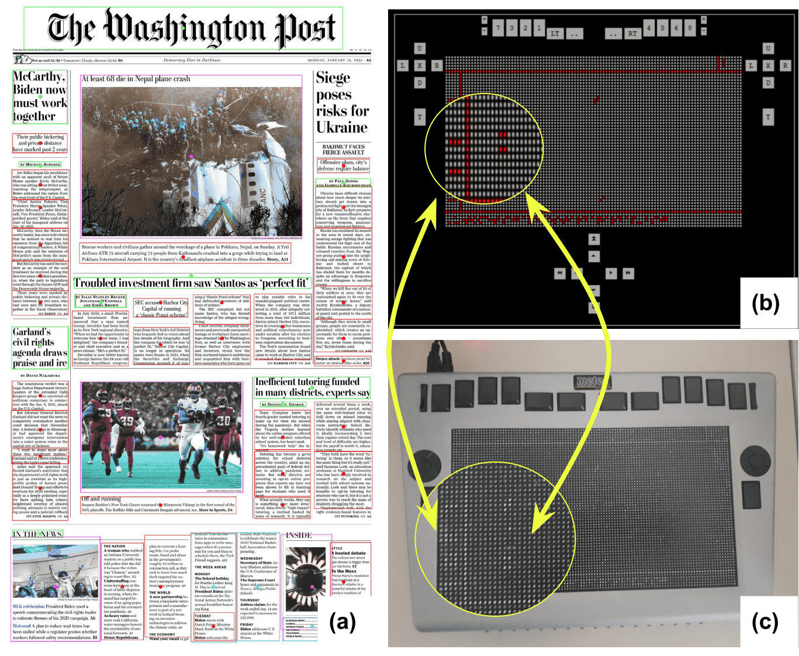

## Accessible Document Layout: An Interface for 2D Tactile Displays

<hr/>

[**Paper**](https://arxiv.org/abs/2212.09802) | [**Video**]() | [**Contact**]() <br/>


This repository contains the codes and the dataset for the paper:

[**Accessible Document Layout: An Interface for 2D Tactile Displays**]() by Omar Moured and Sara Alzalabny.

<div>
<div style="text-align: center">
  
</div>
<div style="margin-top: 5px;">

  
  ## Citation

If you wish to cite us, please use the following BibTeX entry:

```BibTeX
  T0 BE ADDED!
```
